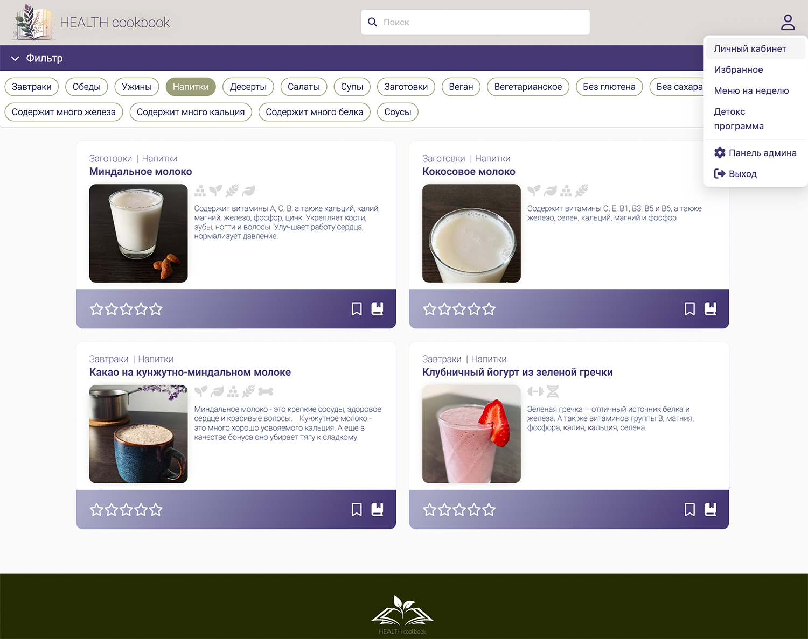
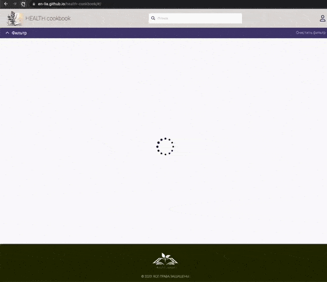
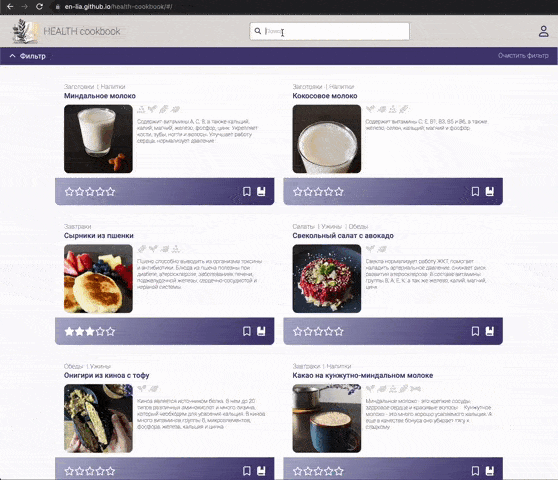
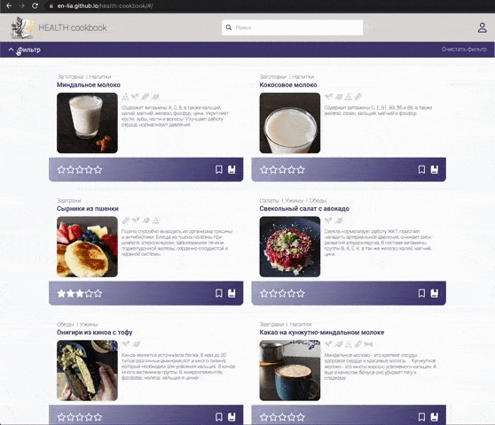
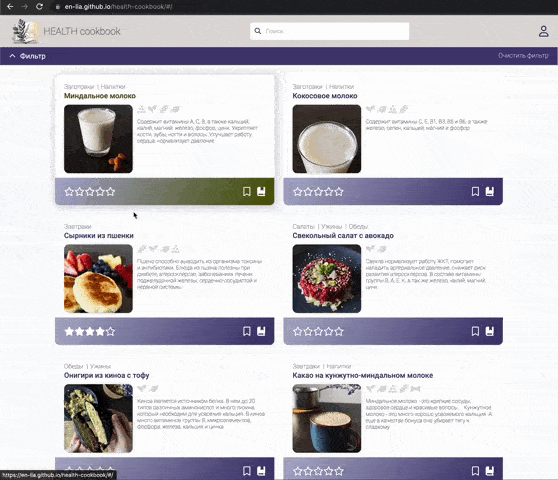
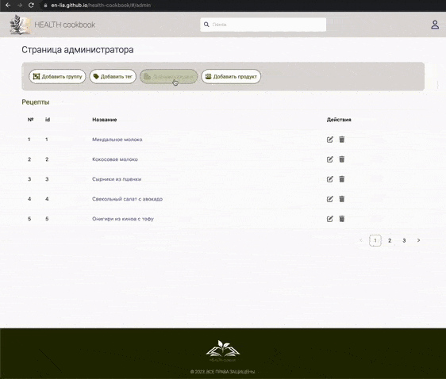
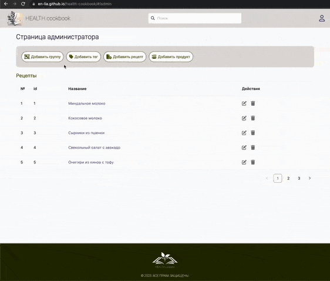
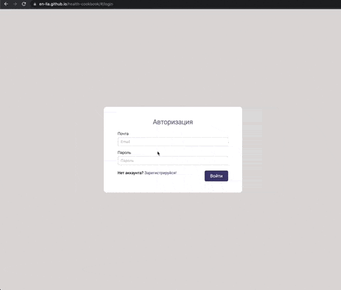

<h1 align="center"> Health Cookbook 🍽 </h1> 

The repository contains the frontend part of the **health-cookbook** application. This is the **MVP version** of the project.

The backend part is in a different repository and implemented on a _local server_.

## Technology Stack
### Frontend:
HTML5, CSS3, JavaScript, React, React-router-dom, TypeScript, Axios, MobX, React Query, webpack, Ant Design

<a href="https://www.w3.org/html/" target="_blank" rel="noreferrer">  </a>
<a href="https://www.w3schools.com/css/" target="_blank" rel="noreferrer">  </a> 
<a href="https://developer.mozilla.org/en-US/docs/Web/JavaScript" target="_blank" rel="noreferrer">  </a>
<a href="https://reactjs.org/" target="_blank" rel="noreferrer">  </a> 
<a href="https://webpack.js.org" target="_blank" rel="noreferrer">  </a>

### Backend:
Node JS, Express, PostgreSQL, Sequelize

<a href="https://nodejs.org" target="_blank" rel="noreferrer">  </a>
<a href="https://expressjs.com" target="_blank" rel="noreferrer">  </a> 
<a href="https://www.postgresql.org" target="_blank" rel="noreferrer">  </a> 


## About application

_**Health Cookbook** is an application with a collection of healthy recipes._

<div align="center">
 </img>
 </img>
</div>

<hr>

_The application implements a search by recipes, by tags, and you can also put down a personal rating for the recipe.
In the future, it will be possible to add to the personal menu for a week with a list of products and create detox programs._

<div align="center">
 </img>
 </img>
 </img>
</div>

<hr>

_The application also has an administrative part with an interface for adding, editing and deleting recipes._

<div align="center">
 </img>
 </img>
 </img>
</div>

<hr>

## Installation & Usage

_Ensure [Node.js](https://nodejs.org/en/) and [NPM](https://www.npmjs.com/) are installed_

1. Clone or Download the repository (Depending on whether you are using SSH or HTTPS)

```
git clone git@github.com:En-lia/health-cookbook.git
```

2. Install dependencies

```
npm install
```

3. Start the application

```
npm start
```